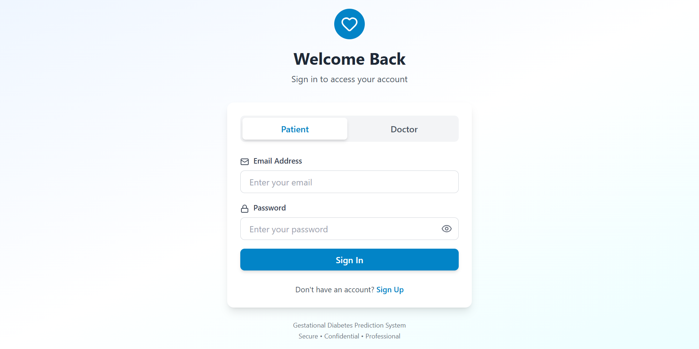
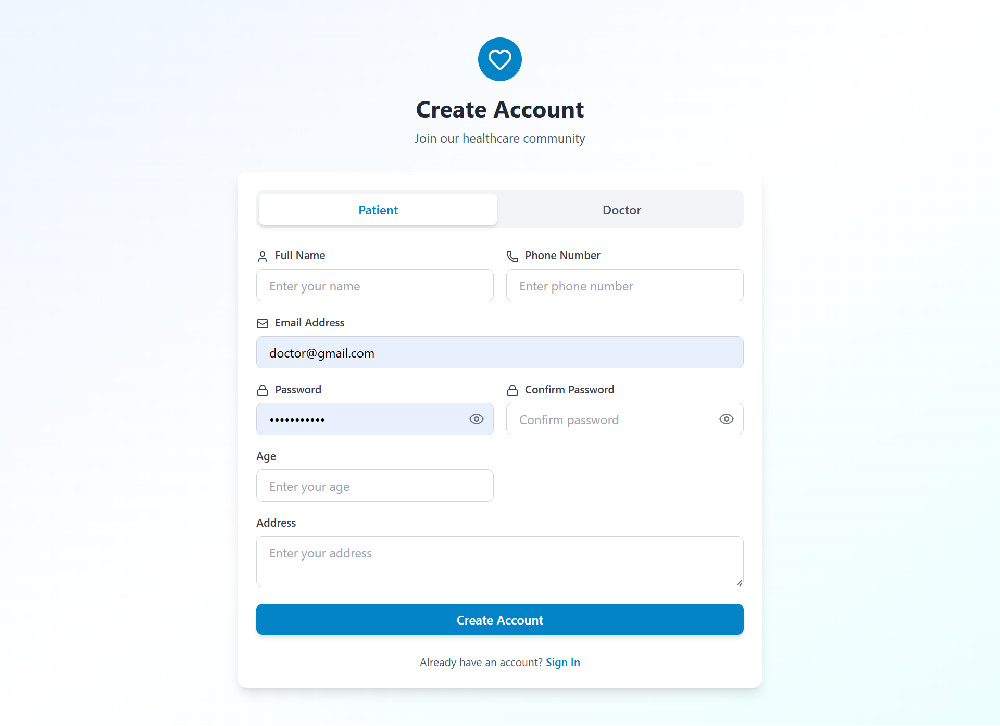
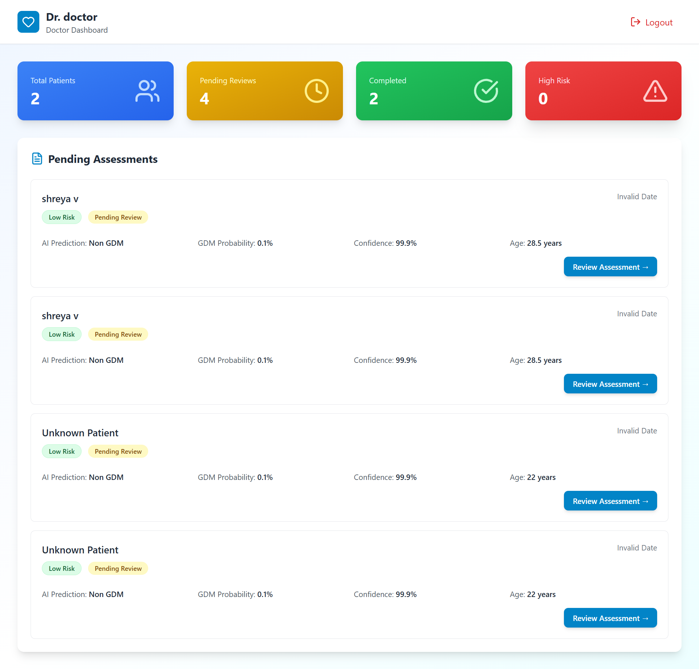
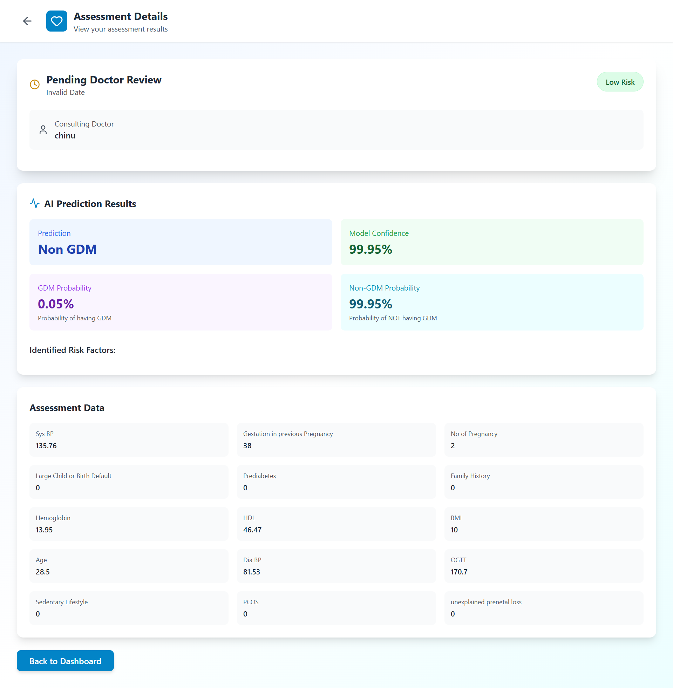
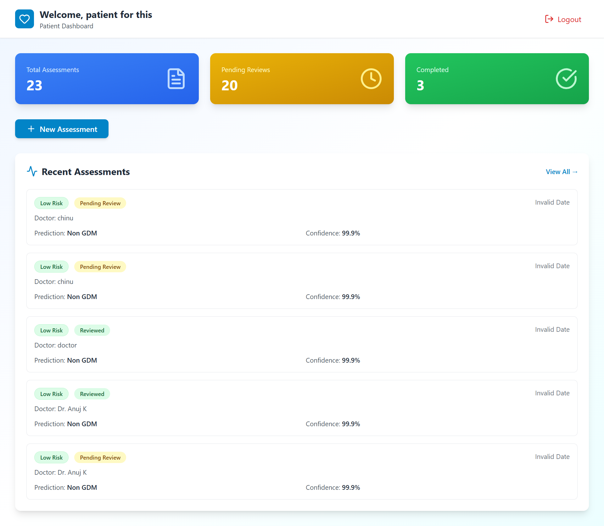
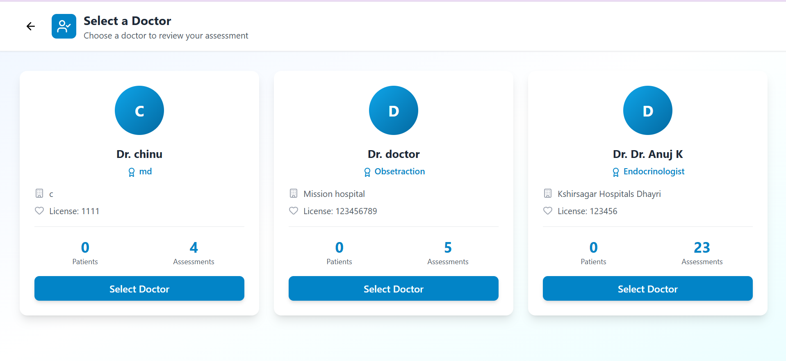
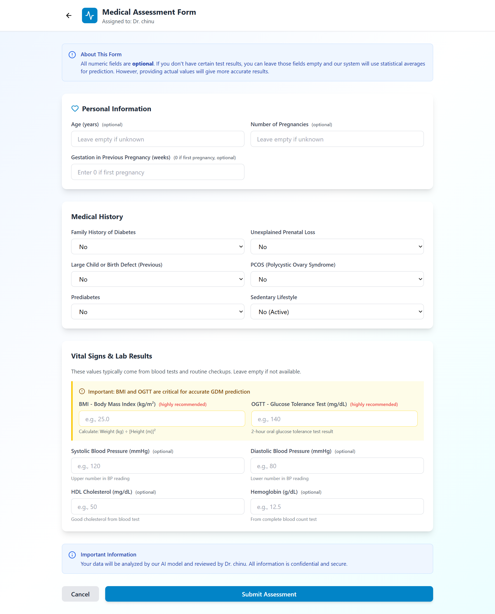

# Gestational Diabetes Prediction System (GDM)

## 📌 Project Overview
The Gestational Diabetes Prediction System is a full-stack web application designed to predict the risk of Gestational Diabetes Mellitus (GDM) in pregnant women. The system helps patients and doctors by providing early risk assessment using machine learning and medical parameters.

---

## 🚀 Key Features
- Role-based authentication (Patient & Doctor)
- Secure login and registration using Firebase Authentication
- Patients can fill medical assessment forms and select a doctor
- Doctors can review assessments and give medical feedback
- Machine Learning model predicts:
  - GDM / Non-GDM
  - Risk level (Low / Moderate / High)
  - Probability and confidence
- Clean and user-friendly dashboard for both roles

---

## 🛠️ Technologies Used

### Frontend
- React.js
- JavaScript
- Tailwind CSS
- Vite

### Backend
- Python
- FastAPI
- REST APIs

### Machine Learning
- Logistic Regression
- Random Forest
- XGBoost
- Ensemble Learning

### Database & Auth
- Firebase Authentication
- Firebase Firestore

---

## ⚙️ Project Workflow
1. User registers or logs in (Firebase Auth)
2. Patient fills medical assessment form
3. Data is sent to FastAPI backend
4. ML model predicts GDM risk
5. Results are stored and shown on patient dashboard
6. Doctor reviews and provides medical recommendations

---

## 📸 Project Screenshots

### 🔐 Authentication

### 👩‍⚕️ Doctor Dashboard

### 👩‍🍼 Patient Flow

### 🤖 ML Prediction Result

---
